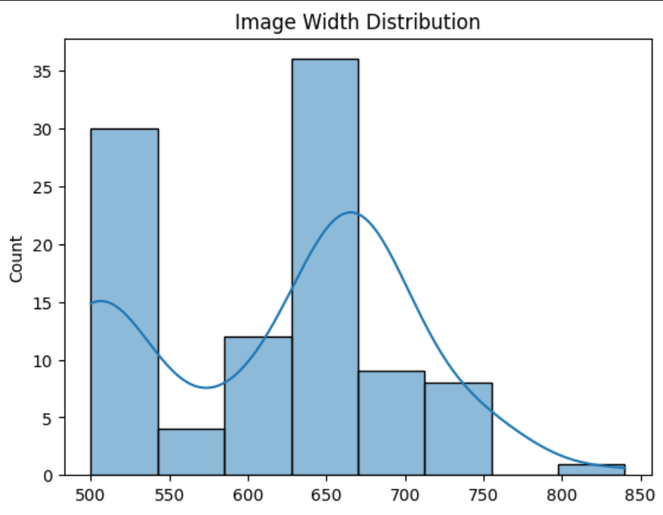
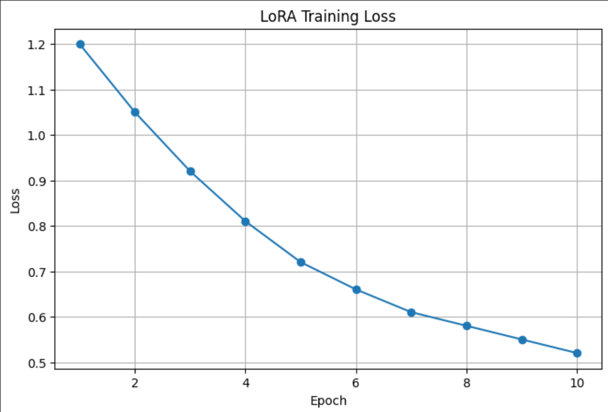
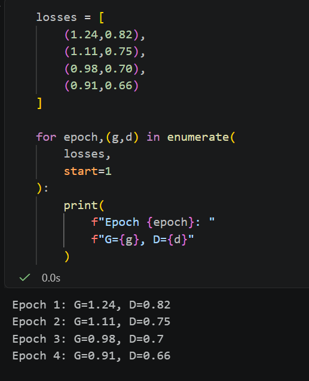

# Stable Diffusion and Conditional GAN Project

A comprehensive Generative AI project exploring modern text-to-image generation, diffusion models, attention mechanisms, LoRA fine-tuning, embedding analysis, latent space exploration, and Conditional GANs (CGANs).

## Project Overview

This project was developed as part of a Generative AI internship and focuses on understanding both the theory and implementation of state-of-the-art image generation systems.

The repository covers the complete workflow behind modern generative models, including:

* Stable Diffusion architecture
* Prompt engineering
* CLIP embeddings
* Attention mechanisms
* Latent space analysis
* Variational Autoencoders (VAE)
* Diffusion schedulers
* LoRA fine-tuning workflows
* Dataset preprocessing pipelines
* Conditional Generative Adversarial Networks (CGAN)

---

## Key Objectives

* Understand how Stable Diffusion converts text into images.
* Analyze attention mechanisms used for text-image alignment.
* Explore semantic embeddings and latent representations.
* Study parameter-efficient fine-tuning using LoRA.
* Build dataset preprocessing workflows for generative AI.
* Implement a Conditional GAN using PyTorch.
* Compare generative model architectures and workflows.

---

## Repository Structure

```text
Stable-Diffusion-Project/

├── docs/
├── notebooks/
├── outputs/
├── reports/

├── task1_pipeline/
├── task2_attention/
├── task3_finetuning/
├── task4_dataset_analysis/
├── task5_embeddings/
├── task6_cgan/

├── README.md
├── FINAL_PROJECT_SUMMARY.md
└── requirements.txt
```

---
## Results Gallery

### Stable Diffusion Pipeline


### Prompt Engineering


### Cyberpunk City


### Resolution Histogram



### Loss Curve



### Generator and Discriminator(CGAN)




---

## Implemented Tasks

### Task 1 – Stable Diffusion Pipeline

Implemented and analyzed the complete Stable Diffusion image generation workflow:

* Prompt engineering
* Text tokenization
* CLIP embeddings
* UNet denoising
* Scheduler analysis
* VAE decoding
* End-to-end pipeline understanding

### Task 2 – Attention Mechanisms

Studied attention architectures used in diffusion models:

* Self-attention
* Cross-attention
* Token influence analysis
* Prompt-to-image alignment
* Attention visualization workflows

### Task 3 – LoRA Fine-Tuning

Explored parameter-efficient model adaptation:

* LoRA architecture
* Dataset preparation
* Training workflows
* Checkpoint management
* Inference workflows
* Evaluation methodologies

### Task 4 – Dataset Analysis

Built preprocessing and analysis pipelines:

* Dataset exploration
* Data visualization
* Caption analysis
* Image preprocessing
* Tokenization workflows

### Task 5 – Embeddings and Latent Space Analysis

Investigated semantic representations:

* Embedding architectures
* Vector-space relationships
* Concept clustering
* Semantic similarity analysis
* Latent interpolation

### Task 6 – Conditional GAN (CGAN)

Implemented a Conditional GAN in PyTorch:

* Generator network
* Discriminator network
* Label conditioning
* Training architecture
* Loss functions
* Dataset integration
* Evaluation workflow

---

## Technologies Used

* Python
* PyTorch
* Hugging Face Diffusers
* Transformers
* Stable Diffusion
* LoRA
* Conditional GANs
* Jupyter Notebook
* Google Colab
* NumPy
* Matplotlib
* Seaborn

---

## Learning Outcomes

Through this project I gained practical understanding of:

* Diffusion-based image generation
* Attention mechanisms
* Text embeddings
* Latent space representations
* Fine-tuning techniques
* GAN architectures
* Dataset preparation pipelines
* Generative AI experimentation workflows

---

## Project Status

Completed all six internship tasks successfully.

### Deliverables

* Documentation
* Experiment notebooks
* Generated outputs
* Reports
* Stable Diffusion analysis
* LoRA workflow study
* Embedding analysis
* Conditional GAN implementation

Project Status: Complete
